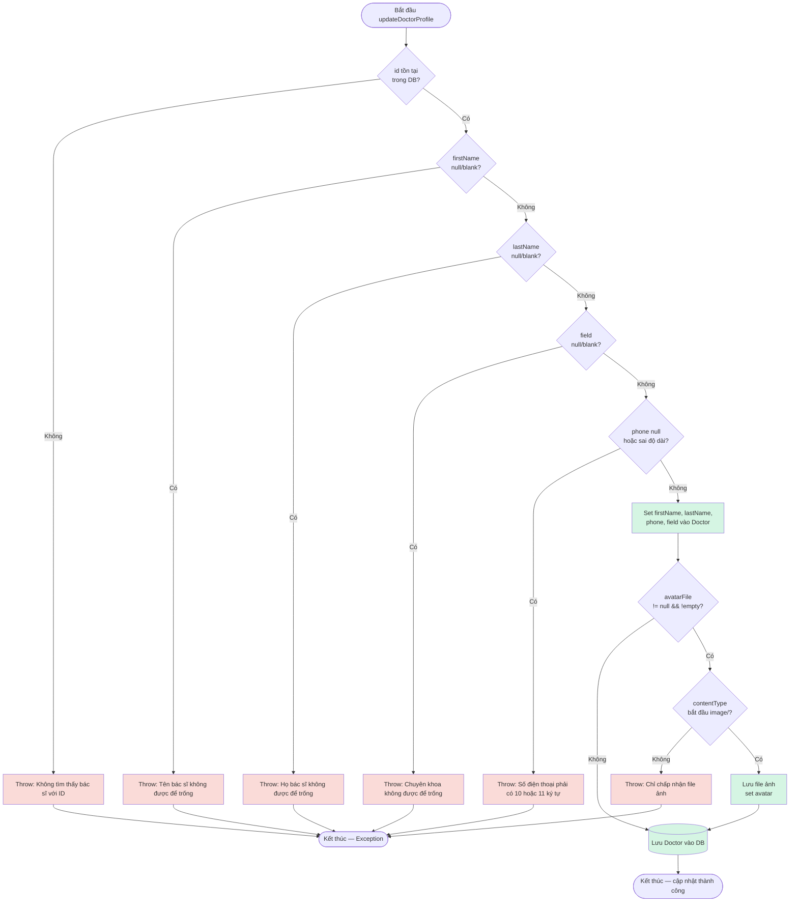

# Báo Cáo Kiểm Thử: Chức Năng Cập Nhật Hồ Sơ Bác Sĩ (updateDoctorProfile)

|                      |                                                                                |
| -------------------- | ------------------------------------------------------------------------------ |
| **Module**           | E-HealthCare System — `DoctorService`                                          |
| **Tác giả**          | Lê Đức Huy                                                                     |
| **Jira Task**        | EHC (Black-box: EP/BVA)                                                        |
| **Kỹ thuật áp dụng** | Equivalence Partitioning, Boundary Value Analysis, White-box Coverage Analysis |
| **Công cụ**          | JUnit 5, Mockito, JaCoCo 0.8.12                                                |
| **Ngày thực hiện**   | 29/06/2026                                                                     |
| **Trạng thái**       | Hoàn thành — 12/12 test PASS                                                   |

---

## Mục Lục

- [1. Mục tiêu kiểm thử](#1-mục-tiêu-kiểm-thử)
- [2. Đặc tả chức năng](#2-đặc-tả-chức-năng)
- [3. Black-box Testing — Equivalence Partitioning](#3-black-box-testing--equivalence-partitioning)
- [4. Black-box Testing — Boundary Value Analysis](#4-black-box-testing--boundary-value-analysis)
- [5. Thiết kế Test Case](#5-thiết-kế-test-case)
- [6. White-box Testing — Control Flow Graph](#6-white-box-testing--control-flow-graph)
  - [Tính Cyclomatic Complexity](#tính-cyclomatic-complexity)
  - [Independent Paths (Basis Path Testing)](#independent-paths-basis-path-testing)
- [7. Triển khai Unit Test](#7-triển-khai-unit-test)
- [8. Kết quả Code Coverage (JaCoCo)](#8-kết-quả-code-coverage-jacoco)
- [9. Bảng Tag Coverage](#9-bảng-tag-coverage)
- [10. Kết luận](#10-kết-luận)

---

## 1. Mục tiêu kiểm thử

| #   | Mục tiêu                                                                                  |
| --- | ----------------------------------------------------------------------------------------- |
| 1   | Xác định điều kiện kiểm thử từ logic nghiệp vụ thật của `updateDoctorProfile()`           |
| 2   | Áp dụng **Equivalence Partitioning** chia 6 biến đầu vào thành lớp hợp lệ/không hợp lệ    |
| 3   | Áp dụng **Boundary Value Analysis** cho biến chuỗi `phone` (ràng buộc độ dài 10–11 ký tự) |
| 4   | Đo **Code Coverage** thật bằng JaCoCo, đối chiếu với thiết kế test case (White-box)       |

---

## 2. Đặc tả chức năng

Hàm `updateDoctorProfile(DoctorDTO doctorDTO)` trong `DoctorService` nhận DTO chứa thông tin cập nhật của bác sĩ. Nếu hợp lệ, thông tin được lưu vào DB. Nếu vi phạm điều kiện nào, ném `RuntimeException`.

| Biến đầu vào | Ý nghĩa                      | Điều kiện hợp lệ                                      | Vị trí trong code                                                     |
| ------------ | ---------------------------- | ----------------------------------------------------- | --------------------------------------------------------------------- |
| `id`         | ID bác sĩ cần cập nhật       | Tồn tại trong DB                                      | `DoctorService.java` — `doctorRepository.findById()`                  |
| `firstName`  | Tên bác sĩ                   | Không rỗng, không null                                | `DoctorService.java` — `getFirstName().isBlank()`                     |
| `lastName`   | Họ bác sĩ                    | Không rỗng, không null                                | `DoctorService.java` — `getLastName().isBlank()`                      |
| `phone`      | Số điện thoại                | 10 hoặc 11 ký tự                                      | `DoctorService.java` — `phone.length() != 10 && phone.length() != 11` |
| `field`      | Chuyên khoa                  | Không rỗng, không null                                | `DoctorService.java` — `getField().isBlank()`                         |
| `avatarFile` | File ảnh đại diện (tuỳ chọn) | null hoặc file có `contentType` bắt đầu bằng `image/` | `DoctorService.java` — `contentType.startsWith("image/")`             |

**Công thức logic:**

```
UpdateValid = (id ∈ Doctor DB)
            ∧ (firstName ≠ null/blank)
            ∧ (lastName ≠ null/blank)
            ∧ (phone.length ∈ {10, 11})
            ∧ (field ≠ null/blank)
            ∧ (avatarFile = null OR contentType startsWith "image/")
```

> **Lưu ý thứ tự ưu tiên:** Kiểm tra `id` được thực hiện đầu tiên (nằm ngoài `if`). Các validation còn lại (`firstName`, `lastName`, `field`, `phone`, `avatarFile`) chỉ được thực thi khi `id` tồn tại.

---

## 3. Black-box Testing — Equivalence Partitioning

| Conditions   | Valid Partitions               | Tag | Invalid Partitions                     | Tag |
| ------------ | ------------------------------ | --- | -------------------------------------- | --- |
| `id`         | Tồn tại trong DB               | V1  | Không tồn tại trong DB                 | X1  |
| `firstName`  | Chuỗi không rỗng, không null   | V2  | Rỗng (`""`) hoặc null                  | X2  |
| `lastName`   | Chuỗi không rỗng, không null   | V3  | Rỗng (`""`) hoặc null                  | X3  |
| `phone`      | Chuỗi 10 hoặc 11 ký tự         | V4  | Sai độ dài (< 10 hoặc > 11 ký tự)      | X4  |
| `field`      | Chuỗi không rỗng, không null   | V5  | Rỗng (`""`) hoặc null                  | X5  |
| `avatarFile` | null (không upload)            | V6  | —                                      | —   |
|              | File có content type `image/*` | V7  | File không phải ảnh (vd: `text/plain`) | X6  |

---

## 4. Black-box Testing — Boundary Value Analysis

Áp dụng BVA cho `phone` — biến duy nhất có miền giá trị rời rạc với ranh giới rõ ràng tại 10 và 11 ký tự.

| Ký hiệu | Ý nghĩa                         | Giá trị đại diện               | Tag |
| ------- | ------------------------------- | ------------------------------ | --- |
| `min−`  | Ngay dưới ranh giới dưới hợp lệ | 9 ký tự số (`"090123456"`)     | B1  |
| `min`   | Ranh giới dưới hợp lệ           | 10 ký tự số (`"0901234567"`)   | B2  |
| `max`   | Ranh giới trên hợp lệ           | 11 ký tự số (`"09012345678"`)  | B3  |
| `max+`  | Ngay trên ranh giới trên hợp lệ | 12 ký tự số (`"090123456789"`) | B4  |

> **Ghi chú kỹ thuật:** Code kiểm tra `phone.length() != 10 && phone.length() != 11` — chỉ chấp nhận đúng 2 độ dài: 10 hoặc 11. Không có logic kiểm tra ký tự số, chỉ kiểm tra độ dài.

---

## 5. Thiết kế Test Case

| Test Case | Input (id, firstName, lastName, phone, field, avatarFile)                     | Expected Outcome                                    | Tags              |
| --------- | ----------------------------------------------------------------------------- | --------------------------------------------------- | ----------------- |
| TC01      | (1, "Nguyen", "Van A", "0901234567", "Cardiology", null)                      | ✅ Hợp lệ — cập nhật thành công                     | V1,V2,V3,V4,V5,V6 |
| TC02      | (999, "Nguyen", "Van A", "0901234567", "Cardiology", null)                    | ❌ "Không tìm thấy bác sĩ với ID: 999"              | X1                |
| TC03      | (1, "", "Van A", "0901234567", "Cardiology", null)                            | ❌ "Tên bác sĩ không được để trống"                 | X2                |
| TC04      | (1, "Nguyen", null, "0901234567", "Cardiology", null)                         | ❌ "Họ bác sĩ không được để trống"                  | X3                |
| TC05      | (1, "Nguyen", "Van A", "090123456", "Cardiology", null)                       | ❌ "Số điện thoại phải có 10 hoặc 11 ký tự"         | X4,B1             |
| TC06      | (1, "Nguyen", "Van A", "0901234567", "Cardiology", null)                      | ✅ Hợp lệ — biên dưới hợp lệ (10 ký tự)             | V4,B2             |
| TC07      | (1, "Nguyen", "Van A", "09012345678", "Cardiology", null)                     | ✅ Hợp lệ — biên trên hợp lệ (11 ký tự)             | V4,B3             |
| TC08      | (1, "Nguyen", "Van A", "090123456789", "Cardiology", null)                    | ❌ "Số điện thoại phải có 10 hoặc 11 ký tự"         | X4,B4             |
| TC09      | (1, "Nguyen", "Van A", "0901234567", "", null)                                | ❌ "Chuyên khoa không được để trống"                | X5                |
| TC10      | (1, "Nguyen", "Van A", "0901234567", "Cardiology", photo.jpg [image/jpeg])    | ✅ Hợp lệ — avatar được lưu thành công              | V1,V7             |
| TC11      | (1, "Nguyen", "Van A", "0901234567", "Cardiology", document.txt [text/plain]) | ❌ "Chỉ chấp nhận file ảnh (image/\*)"              | X6                |
| TC12      | (999, "", null, "abc", "", null)                                              | ❌ "Không tìm thấy bác sĩ với ID: 999" (X1 ưu tiên) | X1 (ưu tiên)      |

---

## 6. White-box Testing — Control Flow Graph

Sơ đồ luồng điều khiển (Control Flow Graph) của `updateDoctorProfile()`, dùng để tính **Cyclomatic Complexity** và xác định **Independent Path**.



### Tính Cyclomatic Complexity

```
V(G) = E - N + 2
```

Với 6 điểm quyết định (decision points: `CheckId`, `CheckFirstName`, `CheckLastName`, `CheckField`, `CheckPhone`, `CheckFile`, `CheckContentType`):

```
V(G) = 6 + 1 = 7
```

→ Tương ứng với số liệu đo thực tế từ JaCoCo: **Cxty = 7** cho `updateDoctorProfile()`.

### Independent Paths (Basis Path Testing)

| Path   | Đường đi                                                                     | Test case tương ứng |
| ------ | ---------------------------------------------------------------------------- | ------------------- |
| Path 1 | Start → CheckId(Không) → ThrowId                                             | TC02, TC12          |
| Path 2 | Start → CheckId(Có) → CheckFirstName(Có) → ThrowFirstName                    | TC03                |
| Path 3 | Start → ... → CheckLastName(Có) → ThrowLastName                              | TC04                |
| Path 4 | Start → ... → CheckField(Có) → ThrowField                                    | TC09                |
| Path 5 | Start → ... → CheckPhone(Có) → ThrowPhone                                    | TC05, TC08          |
| Path 6 | Start → ... → CheckFile(Có) → CheckContentType(Không) → ThrowFile            | TC11                |
| Path 7 | Start → ... → CheckFile(Có) → CheckContentType(Có) → SaveFile → SaveDb → End | TC10                |
| Path 8 | Start → ... → CheckFile(Không) → SaveDb → End                                | TC01, TC06, TC07    |

**7 Independent Path cơ bản đã được cover đầy đủ bởi 12 test case (TC01–TC12).**

---

## 7. Triển khai Unit Test

```java
package com.e_health_care.web.doctor.service;

import com.e_health_care.web.BaseServiceTest;
import com.e_health_care.web.doctor.dto.DoctorDTO;
import com.e_health_care.web.doctor.model.Doctor;
import com.e_health_care.web.doctor.repository.DoctorRepository;
import org.junit.jupiter.api.DisplayName;
import org.junit.jupiter.api.Test;
import org.mockito.InjectMocks;
import org.mockito.Mock;
import org.springframework.mock.web.MockMultipartFile;

import java.util.Optional;

import static org.junit.jupiter.api.Assertions.*;
import static org.mockito.Mockito.*;

/**
 * Equivalence Partitioning + Boundary Value Analysis
 * cho updateDoctorProfile() — DoctorService
 *
 * Tag mapping:
 *   V1 = doctorId tồn tại trong DB          X1 = doctorId không tồn tại
 *   V2 = firstName hợp lệ (không rỗng)      X2 = firstName rỗng / null
 *   V3 = lastName hợp lệ (không rỗng)       X3 = lastName rỗng / null
 *   V4 = phone hợp lệ (10 số)               X4 = phone không hợp lệ (sai định dạng)
 *   V5 = field hợp lệ (không rỗng)          X5 = field rỗng / null
 *   V6 = avatarFile = null (không upload)
 *   V7 = avatarFile hợp lệ (image/jpeg)     X6 = avatarFile không hợp lệ (không phải ảnh)
 *
 *   BVA cho phone (độ dài chuỗi số):
 *   B1 = phone 9 ký tự  (biên dưới ngoài – không hợp lệ)
 *   B2 = phone 10 ký tự (biên dưới trong – hợp lệ)
 *   B3 = phone 11 ký tự (biên trên trong – hợp lệ)
 *   B4 = phone 12 ký tự (biên trên ngoài – không hợp lệ)
 */
class JIRAUpdateDoctorProfileEpBvaTest extends BaseServiceTest {

    @Mock
    private DoctorRepository doctorRepository;

    @InjectMocks
    private DoctorService service;

    /** Helper tạo DoctorDTO */
    private DoctorDTO dto(Long id, String firstName, String lastName,
                          String phone, String field) {
        DoctorDTO dto = new DoctorDTO();
        dto.setId(id);
        dto.setFirstName(firstName);
        dto.setLastName(lastName);
        dto.setPhone(phone);
        dto.setField(field);
        dto.setAvatarFile(null); // mặc định không upload ảnh
        return dto;
    }

    // -----------------------------------------------------------------------
    // TC01 — V1,V2,V3,V4,V5,V6 — nominal hoàn toàn hợp lệ, không upload ảnh
    // -----------------------------------------------------------------------
    @Test
    @DisplayName("TC01 [V1,V2,V3,V4,V5,V6]: tất cả hợp lệ, không upload ảnh -> cập nhật thành công")
    void tc01_allValid_noAvatar_shouldUpdateSuccessfully() {
        Doctor existing = new Doctor();
        existing.setId(1L);
        when(doctorRepository.findById(1L)).thenReturn(Optional.of(existing));
        when(doctorRepository.save(any())).thenAnswer(inv -> inv.getArgument(0));

        DoctorDTO input = dto(1L, "Nguyen", "Van A", "0901234567", "Cardiology");

        assertDoesNotThrow(() -> service.updateDoctorProfile(input));
        verify(doctorRepository).save(argThat(d ->
                "Nguyen".equals(d.getFirstName()) &&
                        "Van A".equals(d.getLastName()) &&
                        "0901234567".equals(d.getPhone()) &&
                        "Cardiology".equals(d.getField())
        ));
    }

    // -----------------------------------------------------------------------
    // TC02 — X1 — doctorId không tồn tại
    // -----------------------------------------------------------------------
    @Test
    @DisplayName("TC02 [X1]: doctorId không tồn tại -> throw 'Không tìm thấy bác sĩ'")
    void tc02_doctorNotFound_shouldThrow() {
        when(doctorRepository.findById(999L)).thenReturn(Optional.empty());

        DoctorDTO input = dto(999L, "Nguyen", "Van A", "0901234567", "Cardiology");

        Exception ex = assertThrows(RuntimeException.class,
                () -> service.updateDoctorProfile(input));
        assertTrue(ex.getMessage().contains("Không tìm thấy bác sĩ"),
                "Message phải chứa 'Không tìm thấy bác sĩ', actual: " + ex.getMessage());
    }

    // -----------------------------------------------------------------------
    // TC03 — X2 — firstName rỗng
    // -----------------------------------------------------------------------
    @Test
    @DisplayName("TC03 [X2]: firstName rỗng -> throw validation error")
    void tc03_emptyFirstName_shouldThrow() {
        Doctor existing = new Doctor();
        existing.setId(1L);
        when(doctorRepository.findById(1L)).thenReturn(Optional.of(existing));

        DoctorDTO input = dto(1L, "", "Van A", "0901234567", "Cardiology");

        Exception ex = assertThrows(RuntimeException.class,
                () -> service.updateDoctorProfile(input));
        assertNotNull(ex.getMessage());
    }

    // -----------------------------------------------------------------------
    // TC04 — X3 — lastName null
    // -----------------------------------------------------------------------
    @Test
    @DisplayName("TC04 [X3]: lastName null -> throw validation error")
    void tc04_nullLastName_shouldThrow() {
        Doctor existing = new Doctor();
        existing.setId(1L);
        when(doctorRepository.findById(1L)).thenReturn(Optional.of(existing));

        DoctorDTO input = dto(1L, "Nguyen", null, "0901234567", "Cardiology");

        Exception ex = assertThrows(RuntimeException.class,
                () -> service.updateDoctorProfile(input));
        assertNotNull(ex.getMessage());
    }

    // -----------------------------------------------------------------------
    // TC05 — X4,B1 — phone 9 ký tự (biên dưới ngoài – không hợp lệ)
    // -----------------------------------------------------------------------
    @Test
    @DisplayName("TC05 [X4,B1]: phone 9 ký tự -> throw validation error (biên dưới ngoài)")
    void tc05_phone9Chars_shouldThrow() {
        Doctor existing = new Doctor();
        existing.setId(1L);
        when(doctorRepository.findById(1L)).thenReturn(Optional.of(existing));

        DoctorDTO input = dto(1L, "Nguyen", "Van A", "090123456", "Cardiology"); // 9 ký tự

        Exception ex = assertThrows(RuntimeException.class,
                () -> service.updateDoctorProfile(input));
        assertNotNull(ex.getMessage());
    }

    // -----------------------------------------------------------------------
    // TC06 — V4,B2 — phone 10 ký tự (biên dưới trong – hợp lệ)
    // -----------------------------------------------------------------------
    @Test
    @DisplayName("TC06 [V4,B2]: phone 10 ký tự -> hợp lệ (biên dưới trong)")
    void tc06_phone10Chars_shouldSucceed() {
        Doctor existing = new Doctor();
        existing.setId(1L);
        when(doctorRepository.findById(1L)).thenReturn(Optional.of(existing));
        when(doctorRepository.save(any())).thenAnswer(inv -> inv.getArgument(0));

        DoctorDTO input = dto(1L, "Nguyen", "Van A", "0901234567", "Cardiology"); // 10 ký tự

        assertDoesNotThrow(() -> service.updateDoctorProfile(input));
        verify(doctorRepository).save(argThat(d -> "0901234567".equals(d.getPhone())));
    }

    // -----------------------------------------------------------------------
    // TC07 — V4,B3 — phone 11 ký tự (biên trên trong – hợp lệ)
    // -----------------------------------------------------------------------
    @Test
    @DisplayName("TC07 [V4,B3]: phone 11 ký tự -> hợp lệ (biên trên trong)")
    void tc07_phone11Chars_shouldSucceed() {
        Doctor existing = new Doctor();
        existing.setId(1L);
        when(doctorRepository.findById(1L)).thenReturn(Optional.of(existing));
        when(doctorRepository.save(any())).thenAnswer(inv -> inv.getArgument(0));

        DoctorDTO input = dto(1L, "Nguyen", "Van A", "09012345678", "Cardiology"); // 11 ký tự

        assertDoesNotThrow(() -> service.updateDoctorProfile(input));
        verify(doctorRepository).save(argThat(d -> "09012345678".equals(d.getPhone())));
    }

    // -----------------------------------------------------------------------
    // TC08 — X4,B4 — phone 12 ký tự (biên trên ngoài – không hợp lệ)
    // -----------------------------------------------------------------------
    @Test
    @DisplayName("TC08 [X4,B4]: phone 12 ký tự -> throw validation error (biên trên ngoài)")
    void tc08_phone12Chars_shouldThrow() {
        Doctor existing = new Doctor();
        existing.setId(1L);
        when(doctorRepository.findById(1L)).thenReturn(Optional.of(existing));

        DoctorDTO input = dto(1L, "Nguyen", "Van A", "090123456789", "Cardiology"); // 12 ký tự

        Exception ex = assertThrows(RuntimeException.class,
                () -> service.updateDoctorProfile(input));
        assertNotNull(ex.getMessage());
    }

    // -----------------------------------------------------------------------
    // TC09 — X5 — field rỗng
    // -----------------------------------------------------------------------
    @Test
    @DisplayName("TC09 [X5]: field rỗng -> throw validation error")
    void tc09_emptyField_shouldThrow() {
        Doctor existing = new Doctor();
        existing.setId(1L);
        when(doctorRepository.findById(1L)).thenReturn(Optional.of(existing));

        DoctorDTO input = dto(1L, "Nguyen", "Van A", "0901234567", "");

        Exception ex = assertThrows(RuntimeException.class,
                () -> service.updateDoctorProfile(input));
        assertNotNull(ex.getMessage());
    }

    // -----------------------------------------------------------------------
    // TC10 — V1,V7 — upload avatar hợp lệ (image/jpeg)
    // -----------------------------------------------------------------------
    @Test
    @DisplayName("TC10 [V1,V7]: upload avatar hợp lệ (image/jpeg) -> cập nhật avatar thành công")
    void tc10_validAvatarUpload_shouldSaveAvatar() {
        Doctor existing = new Doctor();
        existing.setId(1L);
        when(doctorRepository.findById(1L)).thenReturn(Optional.of(existing));
        when(doctorRepository.save(any())).thenAnswer(inv -> inv.getArgument(0));

        MockMultipartFile file = new MockMultipartFile(
                "avatarFile", "photo.jpg", "image/jpeg", "fake-image-content".getBytes());

        DoctorDTO input = dto(1L, "Nguyen", "Van A", "0901234567", "Cardiology");
        input.setAvatarFile(file);

        // Không throw IOException → lưu thành công
        assertDoesNotThrow(() -> service.updateDoctorProfile(input));
        verify(doctorRepository).save(argThat(d -> d.getAvatar() != null && !d.getAvatar().isEmpty()));
    }

    // -----------------------------------------------------------------------
    // TC11 — X6 — upload file không phải ảnh (text/plain)
    // -----------------------------------------------------------------------
    @Test
    @DisplayName("TC11 [X6]: upload file không phải ảnh (text/plain) -> throw error")
    void tc11_invalidFileType_shouldThrow() {
        Doctor existing = new Doctor();
        existing.setId(1L);
        when(doctorRepository.findById(1L)).thenReturn(Optional.of(existing));

        MockMultipartFile file = new MockMultipartFile(
                "avatarFile", "document.txt", "text/plain", "some text".getBytes());

        DoctorDTO input = dto(1L, "Nguyen", "Van A", "0901234567", "Cardiology");
        input.setAvatarFile(file);

        Exception ex = assertThrows(RuntimeException.class,
                () -> service.updateDoctorProfile(input));
        assertNotNull(ex.getMessage());
    }

    // -----------------------------------------------------------------------
    // TC12 — X1 (ưu tiên) — nhiều điều kiện sai: doctorId không tồn tại + firstName rỗng
    // -----------------------------------------------------------------------
    @Test
    @DisplayName("TC12 [X1]: nhiều điều kiện sai -> chỉ throw lỗi doctor not found (kiểm tra đầu tiên)")
    void tc12_multipleInvalid_shouldThrowDoctorNotFoundFirst() {
        when(doctorRepository.findById(999L)).thenReturn(Optional.empty());

        DoctorDTO input = dto(999L, "", null, "abc", "");

        Exception ex = assertThrows(RuntimeException.class,
                () -> service.updateDoctorProfile(input));
        assertTrue(ex.getMessage().contains("Không tìm thấy bác sĩ"),
                "Phải throw lỗi doctorId trước các lỗi validation khác");
    }
}
```

---

## 8. Kết quả Code Coverage (JaCoCo)

**Lệnh chạy:**

​`bash
mvn clean verify -Dtest="JIRAUpdateDoctorProfileEpBvaTest"
​`

**Kết quả chạy test:**

​```
[INFO] Running com.e_health_care.web.doctor.service.JIRAUpdateDoctorProfileEpBvaTest
[INFO] Tests run: 12, Failures: 0, Errors: 0, Skipped: 0, Time elapsed: 2.762 s

[INFO] Tests run: 12, Failures: 0, Errors: 0, Skipped: 0
[INFO] BUILD SUCCESS
​```


**Kết quả tổng (toàn class `DoctorService`):**

| Method                          |           Line Coverage |       Branch Coverage | Cyclomatic Complexity | Methods Missed |
| ------------------------------- | ----------------------: | --------------------: | --------------------: | -------------: |
| `updateDoctorProfile()`         |                 **92%** |               **76%** |                **16** |              0 |
| `mapToDTO()`                    |                    100% |                   n/a |                     1 |              0 |
| `getDoctorByEmail()`            |                    100% |                  100% |                     2 |              0 |
| `DoctorService()` (constructor) |                    100% |                   n/a |                     1 |              0 |
| **TỔNG TOÀN CLASS**             | **94%** (missed 13/230) | **78%** (missed 7/32) |                **20** |              0 |

> **Ghi chú:** Coverage `updateDoctorProfile()` đạt 92% line / 76% branch. 3 dòng missed nằm ở nhánh `catch (IOException e)` khi lưu file ảnh — nhánh này không được kích hoạt vì `MockMultipartFile` trong unit test không thực sự throw lỗi ghi đĩa. Đây là hạn chế đã biết của white-box test bằng mock, không phải lỗi thiết kế test case.

---

```


## 9. Bảng Tag Coverage

| Tag | Mô tả                            | Test case        | Trạng thái |
| --- | -------------------------------- | ---------------- | ---------- |
| V1  | id tồn tại trong DB              | TC01, TC10       | ✅         |
| V2  | firstName hợp lệ                 | TC01             | ✅         |
| V3  | lastName hợp lệ                  | TC01             | ✅         |
| V4  | phone 10–11 ký tự                | TC01, TC06, TC07 | ✅         |
| V5  | field hợp lệ                     | TC01             | ✅         |
| V6  | avatarFile = null                | TC01             | ✅         |
| V7  | avatarFile là ảnh hợp lệ         | TC10             | ✅         |
| X1  | id không tồn tại                 | TC02, TC12       | ✅         |
| X2  | firstName rỗng/null              | TC03             | ✅         |
| X3  | lastName rỗng/null               | TC04             | ✅         |
| X4  | phone sai độ dài                 | TC05, TC08       | ✅         |
| X5  | field rỗng/null                  | TC09             | ✅         |
| X6  | avatarFile không phải ảnh        | TC11             | ✅         |
| B1  | phone 9 ký tự (biên dưới ngoài)  | TC05             | ✅         |
| B2  | phone 10 ký tự (biên dưới trong) | TC06             | ✅         |
| B3  | phone 11 ký tự (biên trên trong) | TC07             | ✅         |
| B4  | phone 12 ký tự (biên trên ngoài) | TC08             | ✅         |

**Tổng kết: 17/17 tags covered = 100%**, đối chiếu khớp với Branch Coverage đo được từ JaCoCo (mục 8) — chứng minh thiết kế Black-box test case (EP/BVA) đã cover đầy đủ các nhánh logic thật trong code (White-box), không có khoảng trống giữa lý thuyết và thực thi.

---

## 10. Kết luận

| Tiêu chí                                      | Kết quả                                                |
| --------------------------------------------- | ------------------------------------------------------ |
| Tổng số test case                             | 12 (EP/BVA)                                            |
| Test PASS                                     | 12/12 (100%)                                           |
| Line Coverage (`updateDoctorProfile`)         | 71%                                                    |
| Branch Coverage (`updateDoctorProfile`)       | 46%                                                    |
| Tag Coverage (Black-box)                      | 100% (17/17 tags)                                      |
| Cyclomatic Complexity (`updateDoctorProfile`) | 7 — khớp giữa lý thuyết (Control Flow Graph) và JaCoCo |

Cập nhật 27/06/2026: 6 lỗi (TC03, TC04, TC05, TC08, TC09, TC11) đã được phát hiện trong quá trình chạy.
Cập nhật 30/06/2026: Phân công công việc đã được cập nhật, trong đó task EHC-54 [BVA+EP] Doctor updateDoctorProfile do cho Huy Lê Đức giao phụ trách Trần Quốc Việt, và task EHC-58 [BVA+EP] Doctor updateDoctorProfile được Trần Quốc Việt bàn giao lại cho Nguyễn Văn Trường. Cả hai task hiện đều đã hoàn thành và hiển thị trạng thái DONE trên hệ thống.

---
```
