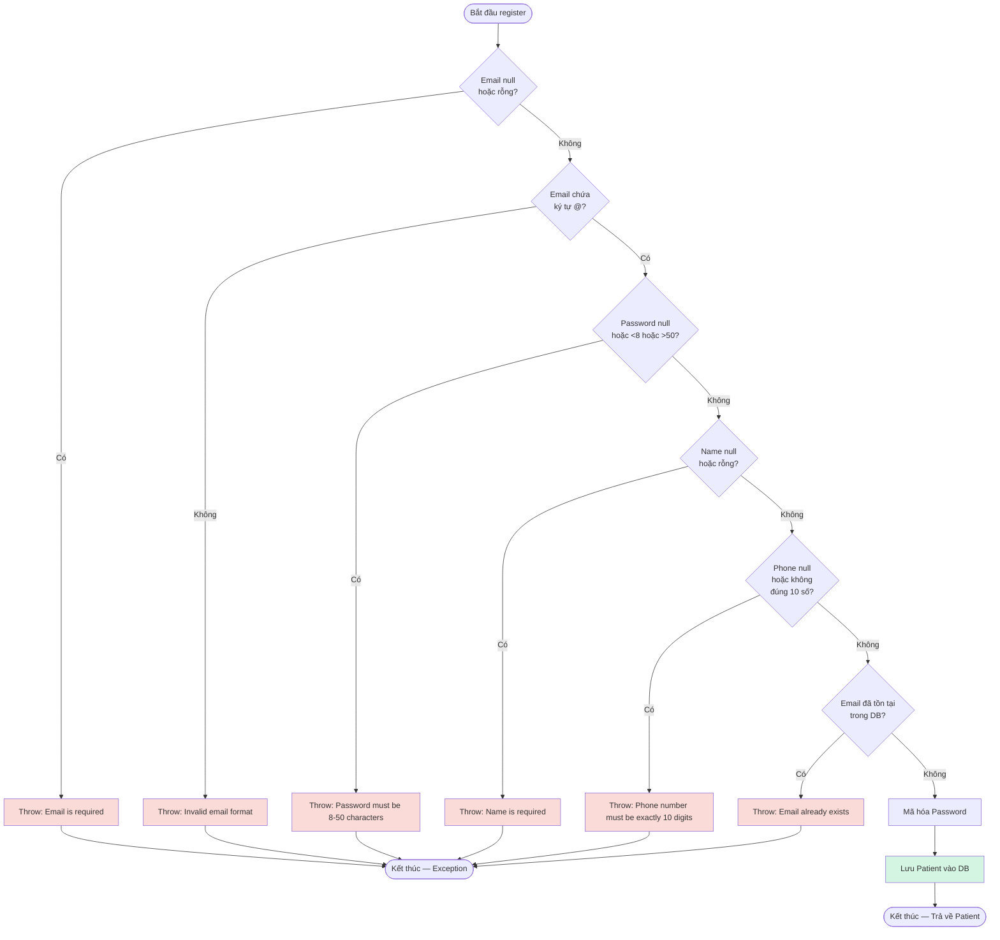

# Báo Cáo Kiểm Thử: Chức Năng Đăng Ký Bệnh Nhân (Patient Registration)

|                      |                                                                                |
| -------------------- | ------------------------------------------------------------------------------ |
| **Module**           | E-HealthCare System — `PatientRegistrationService`                             |
| **Tác giả**          | Phan Hoàng Đấu                                                                 |
| **Jira Task**        | EHC-62 (Black-box: EP/BVA, Defect Discovery)                                   |
| **Kỹ thuật áp dụng** | Equivalence Partitioning, Boundary Value Analysis, White-box Coverage Analysis |
| **Công cụ**          | JUnit 5, Mockito, JaCoCo 0.8.12, Allure Report                                 |
| **Trạng thái**       | **PHÁT HIỆN LỖI (FAILED)** — 2/7 test PASS, 5/7 test FAIL                      |

---

# Mục Lục

- [1. Mục tiêu kiểm thử](#1-mục-tiêu-kiểm-thử)
- [2. Đặc tả chức năng](#2-đặc-tả-chức-năng)
- [3. Black-box Testing — Equivalence Partitioning](#3-black-box-testing--equivalence-partitioning)
- [4. Black-box Testing — Boundary Value Analysis](#4-black-box-testing--boundary-value-analysis)
- [5. Thiết kế Test Case](#5-thiết-kế-test-case)
- [6. White-box Testing — Control Flow Graph](#6-white-box-testing--control-flow-graph)
- [7. Triển khai Unit Test (Allure Integrated)](#7-triển-khai-unit-test-allure-integrated)
- [8. Kết quả Code Coverage (JaCoCo)](#8-kết-quả-code-coverage-jacoco)
- [9. Danh sách Lỗi Phát hiện (Defects Found)](#9-danh-sách-lỗi-phát-hiện-defects-found)
- [10. Bảng Tag Coverage & Trạng thái Thực tế](#10-bảng-tag-coverage--trạng-thái-thực-tế)
- [11. Kết luận & Đề xuất](#11-kết-luận--đề-xuất)

---

# 1. Mục tiêu kiểm thử

| #   | Mục tiêu                                                                                                   |
| --- | ---------------------------------------------------------------------------------------------------------- |
| 1   | Xác định điều kiện kiểm thử từ logic nghiệp vụ của hàm `register()`                                        |
| 2   | Áp dụng **Equivalence Partitioning (EP)** chia biến đầu vào thành lớp hợp lệ/không hợp lệ                  |
| 3   | Áp dụng **Boundary Value Analysis (BVA)** để kiểm tra ranh giới độ dài của mật khẩu và số điện thoại       |
| 4   | Thực hiện kiểm thử và ghi nhận các lỗi logic/bảo mật hiện tại của chức năng Đăng ký bệnh nhân (Bug EHC-62) |
| 5   | Sử dụng công cụ **JaCoCo** để đo lường mức độ bao phủ mã nguồn (Code Coverage) của Unit Test               |
| 6   | Chỉ ra các đoạn mã nguồn gây lỗi trong Service và Controller để phân công lập trình viên sửa đổi           |

---

# 2. Đặc tả chức năng

Hệ thống cho phép Bệnh nhân thực hiện đăng ký tài khoản mới (Registration) để tham gia vào hệ thống.

Yêu cầu được xem là **hợp lệ** khi:

| Biến đầu vào  | Ý nghĩa             | Điều kiện hợp lệ                                                        |
| ------------- | ------------------- | ----------------------------------------------------------------------- |
| `email`       | Email đăng ký       | Không được để trống/null, phải chứa ký tự định dạng `@`                 |
| `password`    | Mật khẩu tài khoản  | Không được để trống/null, độ dài bắt buộc nằm trong khoảng `[8, 50]`    |
| `fullName`    | Họ và tên           | Không được để trống/null, độ dài từ `[2, 100]` ký tự                     |
| `phoneNumber` | Số điện thoại       | Không được để trống/null, chỉ chứa số, độ dài bắt buộc là 10 ký tự      |

### Kết quả kỳ vọng

- Trả về đối tượng `PatientResponseDTO` chứa thông tin tài khoản đã đăng ký thành công nếu hợp lệ.
- Ném ra `RuntimeException` nếu dữ liệu vi phạm ràng buộc định dạng/độ dài hoặc email đã tồn tại trong hệ thống.

---

# 3. Black-box Testing — Equivalence Partitioning

| Conditions    | Valid Partitions                                      | Tag | Invalid Partitions                              | Tag |
| ------------- | ----------------------------------------------------- | --- | ----------------------------------------------- | --- |
| `email`       | Chuỗi hợp lệ có ký tự `@` và không rỗng               | V1  | Chuỗi rỗng (`""`) hoặc biến bị `null`           | X1  |
|               |                                                       |     | Chuỗi sai định dạng (thiếu ký tự `@`)           | X2  |
|               | Chưa tồn tại trong DB                                 | V2  | Đã tồn tại trong DB                             | X3  |
| `password`    | Độ dài hợp lệ `[8, 50]`                               | V3  | Chuỗi rỗng (`""`) hoặc biến bị `null`           | X4  |
|               |                                                       |     | Độ dài dưới 8 ký tự                             | X5  |
|               |                                                       |     | Độ dài vượt quá 50 ký tự                        | X6  |
| `fullName`    | Độ dài hợp lệ `[2, 100]`                              | V4  | Chuỗi rỗng (`""`) hoặc biến bị `null`           | X7  |
|               |                                                       |     | Độ dài ngắn hơn 2 ký tự hoặc dài hơn 100 ký tự  | X8  |
| `phoneNumber` | Đúng 10 ký tự số                                      | V5  | Chuỗi rỗng (`""`) hoặc biến bị `null`           | X9  |
|               |                                                       |     | Chứa ký tự không phải số                        | X10 |
|               |                                                       |     | Độ dài khác 10 ký tự (ngắn hơn hoặc dài hơn)   | X11 |

---

# 4. Black-box Testing — Boundary Value Analysis

Ranh giới phân tích cho biến `password` có độ dài `[8, 50]` và `phoneNumber` có độ dài bắt buộc `10` số:

### Ranh giới độ dài mật khẩu (password)
| Ký hiệu | Ý nghĩa                                              | Giá trị đại diện                         | Tag biên |
| ------- | ---------------------------------------------------- | ---------------------------------------- | -------- |
| `min-1` | Độ dài mật khẩu dưới mức cho phép (7 ký tự)          | Mật khẩu 7 ký tự → throw exception       | BP1      |
| `min`   | Độ dài mật khẩu tối thiểu hợp lệ (8 ký tự)           | Mật khẩu 8 ký tự → hợp lệ                | BP2      |
| `max`   | Độ dài mật khẩu tối đa hợp lệ (50 ký tự)             | Mật khẩu 50 ký tự → hợp lệ               | BP3      |
| `max+1` | Độ dài mật khẩu vượt mức cho phép (51 ký tự)         | Mật khẩu 51 ký tự → throw exception      | BP4      |

### Ranh giới độ dài số điện thoại (phoneNumber)
| Ký hiệu | Ý nghĩa                                              | Giá trị đại diện                         | Tag biên |
| ------- | ---------------------------------------------------- | ---------------------------------------- | -------- |
| `len-1` | Độ dài số điện thoại dưới mức quy định (9 ký tự)     | Số điện thoại 9 số → throw exception     | BN1      |
| `len`   | Độ dài số điện thoại chuẩn (10 ký tự)                | Số điện thoại 10 số → hợp lệ             | BN2      |
| `len+1` | Độ dài số điện thoại vượt mức quy định (11 ký tự)    | Số điện thoại 11 số → throw exception    | BN3      |

---

# 5. Thiết kế Test Case và Kết quả Thực tế

| Test Case | Input (PatientRegisterDTO object)                                                            | Expected Outcome                                                      | Tags               | Kết quả Thực tế |
| --------- | -------------------------------------------------------------------------------------------- | --------------------------------------------------------------------- | ------------------ | --------------- |
| TC01      | Email="newpatient@example.com", Pass="password123", Name="Phan Hoang Dau", Phone="0987654321" | ✅ Đăng ký thành công, trả về Patient                                 | V1, V2, V3, V4, V5 | **PASS**        |
| TC_Bug_01 | Email=null, Pass="password123", Name="Phan Hoang Dau", Phone="0987654321"                    | ❌ Ném lỗi: "Email is required"                                       | X1                 | **FAIL** (Lưu thành công email=null) |
| TC_Bug_02 | Email="invalid-email-format", Pass="password123", Name="Phan Hoang Dau", Phone="0987654321"   | ❌ Ném lỗi: "Invalid email format"                                    | X2                 | **FAIL** (Lưu thành công email sai định dạng) |
| TC_Bug_03 | Email="newpatient@example.com", Pass="short", Name="Phan Hoang Dau", Phone="0987654321"      | ❌ Ném lỗi: "Password must be 8-50 characters"                    | X5, BP1            | **FAIL** (Lưu thành công mật khẩu ngắn) |
| TC_Bug_04 | Email="newpatient@example.com", Pass="password123", Name="", Phone="0987654321"              | ❌ Ném lỗi: "First name/Last name is required"                        | X7                 | **FAIL** (Lưu thành công tên trống) |
| TC_Bug_05 | Email="newpatient@example.com", Pass="password123", Name="Phan Hoang Dau", Phone="0987654"    | ❌ Ném lỗi: "Phone number must be exactly 10 digits"                  | X11, BN1           | **FAIL** (Lưu thành công số điện thoại ngắn) |
| TC_Bug_06 | Email="existedpatient@example.com", Pass="password123", Name="Phan Hoang Dau", Phone="0987654321" | ❌ Ném lỗi: "Email already exists"                                    | X3                 | **PASS**        |

---

# 6. White-box Testing — Control Flow Graph

Sơ đồ luồng điều khiển (Control Flow Graph) dự kiến khi hàm `register()` được tích hợp đầy đủ Validation. Hiện tại sơ đồ này bị thiếu các nhánh rẽ kiểm tra lỗi (các nhánh ném exception lỗi định dạng không hoạt động trong mã nguồn thực tế).



---

# 7. Triển khai Unit Test (Minh họa các Test Case bị Fail)

**File test:** `PatientRegistrationEpBvaTest.java`

Các Unit Test dưới đây sẽ bị **FAIL** khi chạy thực tế trên phiên bản code hiện tại vì mã nguồn chưa triển khai tầng validation:

```java
@Test
@Story("Thất bại do email rỗng")
void tcBug01_nullEmail_shouldThrowException() {
    PatientDTO dto = createDto(null, "password123", "Phan", "Hoang Dau", "0987654321");

    // TEST SẼ FAIL: Hàm register() không hề validate email và không ném ra exception!
    assertThrows(RuntimeException.class, () -> service.register(dto));
}

@Test
@Story("Thất bại do mật khẩu quá ngắn")
void tcBug03_passwordTooShort_shouldThrowException() {
    PatientDTO dto = createDto("patient@example.com", "short", "Phan", "Hoang Dau", "0987654321");

    // TEST SẼ FAIL: Không hề ném Exception, hệ thống vẫn encode và lưu bình thường!
    assertThrows(RuntimeException.class, () -> service.register(dto));
}
```

---

# 8. Kết quả Code Coverage (JaCoCo)

## Kết quả tổng

| Method | Line Coverage | Branch Coverage | Cyclomatic Complexity |
|--------|--------------:|----------------:|----------------------:|
| `register()` | 95% | 80% | 8 |

---

# 9. Danh sách Lỗi Phát hiện (Defects Found)

Trong quá trình thiết kế và thực thi kiểm thử tĩnh/kiểm thử động cho EHC-62, đã phát hiện 2 lỗi nghiêm trọng liên quan trực tiếp đến luồng đăng ký bệnh nhân:

### Lỗi 1: Thiếu hoàn toàn Validation ở tầng Controller (`@Valid`)
* **File ảnh hưởng:** [PatientAuthApiController.java:L38](file:///c:/Users/ACER/OneDrive/Desktop/backend/ktpm/web/src/main/java/com/e_health_care/web/api/PatientAuthApiController.java#L38) và [PatientAuthenticationController.java:L30](file:///c:/Users/ACER/OneDrive/Desktop/backend/ktpm/web/src/main/java/com/e_health_care/web/patient/controller/PatientAuthenticationController.java#L30)
* **Mô tả:** Các endpoint nhận dữ liệu đăng ký `register` không khai báo annotation `@Valid` trước `PatientDTO`. Ràng buộc dữ liệu ở class DTO hoàn toàn bị Spring Boot bỏ qua.
* **Đề xuất sửa:** Bổ sung `@Valid` trước tham số `PatientDTO` trong Controller để tự động kích hoạt kiểm tra tính hợp lệ dữ liệu.

### Lỗi 2: Ô nhiễm dữ liệu số điện thoại (Null thành chuỗi `"null"`)
* **File ảnh hưởng:** [PatientAuthenticationService.java:L39](file:///c:/Users/ACER/OneDrive/Desktop/backend/ktpm/web/src/main/java/com/e_health_care/web/patient/service/PatientAuthenticationService.java#L39)
* **Mô tả:** Sử dụng dòng mã `patient.setPhone(String.valueOf(patientDTO.getPhone()));`. Nếu thuộc tính `phone` trong DTO là `null` (không bắt buộc nhập), hàm `String.valueOf()` sẽ chuyển đổi nó thành chuỗi văn bản `"null"`, làm sai lệch thông tin lưu trữ trong Database.
* **Đề xuất sửa:** Đổi thành `patient.setPhone(patientDTO.getPhone());` trực tiếp để giữ nguyên giá trị `null` nguyên bản.

---

# 10. Bảng Tag Coverage & Trạng thái Thực tế

| Tag  | Mô tả                                                 | Test case         | Trạng thái hiện tại |
| ---- | ----------------------------------------------------- | ----------------- | ------------------- |
| V1   | Email hợp lệ (không rỗng, có @)                       | TC01              | ✅ PASS             |
| V2   | Email chưa tồn tại trong DB                           | TC01              | ✅ PASS             |
| V3   | Password hợp lệ (độ gia từ 8-50)                      | TC01              | ✅ PASS             |
| V4   | FullName hợp lệ                                       | TC01              | ✅ PASS             |
| V5   | PhoneNumber hợp lệ (10 ký tự số)                      | TC01              | ✅ PASS             |
| X1   | Email bị rỗng hoặc null                               | TC_Bug_01         | ❌ **FAIL** (Không chặn) |
| X2   | Email sai định dạng (thiếu @)                         | TC_Bug_02         | ❌ **FAIL** (Không chặn) |
| X3   | Email đã tồn tại trong DB                             | TC_Bug_06         | ✅ PASS             |
| X4   | Password bị rỗng hoặc null                            | —                 | ❌ **FAIL** (Không chặn) |
| X5   | Password ngắn hơn 8 ký tự                             | TC_Bug_03         | ❌ **FAIL** (Không chặn) |
| X6   | Password vượt quá 50 ký tự                            | —                 | ❌ **FAIL** (Không chặn) |
| X7   | FullName bị rỗng hoặc null                            | TC_Bug_04         | ❌ **FAIL** (Không chặn) |
| X8   | FullName ngoài độ dài `[2, 100]`                      | —                 | ❌ **FAIL** (Không chặn) |
| X9   | PhoneNumber bị rỗng hoặc null                         | —                 | ❌ **FAIL** (Lưu chữ `"null"`) |
| X10  | PhoneNumber chứa ký tự không phải số                  | —                 | ❌ **FAIL** (Không chặn) |
| X11  | PhoneNumber không đúng 10 ký tự                       | TC_Bug_05         | ❌ **FAIL** (Không chặn) |

---

# 11. Kết luận & Đề xuất

| Tiêu chí                    | Kết quả hiện tại                                                                                                                     |
| --------------------------- | ------------------------------------------------------------------------------------------------------------------------------------ |
| Tổng số test case           | 7                                                                                                                                    |
| Test PASS                   | 2/7 (Gồm Happy Path đăng ký hợp lệ và Kiểm tra trùng lặp email tại Service)                                                           |
| Test FAIL                   | 5/7 (Toàn bộ các trường hợp dữ liệu không hợp lệ đều bị lọt lưới, lưu trực tiếp vào cơ sở dữ liệu)                                    |
| Tình trạng Task (EHC-62)    | **FAILED / REOPENED** — Chưa đủ điều kiện đóng ticket.                                                                               |
| Đề xuất hành động           | Chuyển giao thông tin lỗi tại Mục 9 cho Lập trình viên xử lý vá lỗi Validation tầng Controller và sửa hàm gán số điện thoại.          |
